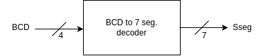
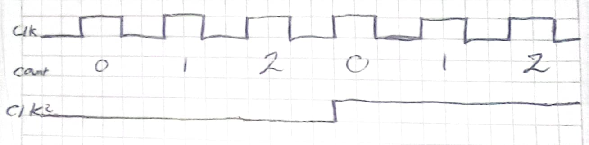

[](https://classroom.github.com/online_ide?assignment_repo_id=19716634&assignment_repo_type=AssignmentRepo)
# Lab03: Decodificador BCD a 7segmentos


## Integrantes 
[David Chaparro](https://github.com/DavidChaparro10)


## Informe

Indice:

1. [Diseño implementado](#1-diseño-implementado)
2. [Descripción](#2-descripción)
3. [DIagramas](#3-diagramas)
4. [Simulaciones](#4-simulaciones)
5. [Implementación](#5-implementación)
6. [Conclusiones](#conclusiones)

## 1. Diseño implementado

### 2. Descripción

El BCD significa "Binary COoe Decimal". El cual es un codificador que convierte un número binario en decimal. Cuando nos adentramos a la parte circuital tenemos 2 tipos de BCD´s: De ánodo común y de cátodo común. Eso depende de la FPGA:


 En el caso de la Cyclone IV que usamos en clase, es de ándodo común. Esto significa que están conectados ya sea a tierra o a VCC. En el caso de nuestra FPGA el led prende cuando está a un nivel bajo (para encender un led se debe dar un cero lógico).

En la primera parte se implementó un 7 segmentos que me representa 1 bit. La segunda parte es más compleja, ya que queremos ampliar los bits.
### 3. Diagramas


Primero se debe elegir el bloque funcional del diseño:



Puedo seleccionar el numero en binario a decimal (similar a un multiplexor), eso es problemático porque debo activar uno para mostrar las unidades, luego las decenas y luego las centenas. Entonces ahi es donde entra la **logica secuencial** Si no estuviera multiplexado la lógica seria siendo combinacional. En esta FPGA resulta que los 7 segmentos están interconectados de la siguiente manera:


Hay FPGA´s que tienen 7 para cada uno. Pero en nuestro caso nunca van a estar prendidos al mismo tiempo.  Así que vamos a jugar con la frecuencia para que el usuario no note la diferencia. El truco está en que, como la frecuencia es tan grande, vamos a ver un fenómeno visual donde "pareciera" que estuviera encendido pero en realidad la tasa de refresco es muy alta.  Pero para eso necesitamos una señal clock.

## 4. Simulaciones 


## 5. Implementación

### Selección de ánodo
Para que el ánodo no esté fijado, se toma como **input** o entrada.


### Selector y Carry Out
El signo se puede poner como un caso especial. Como idea se puede sacar del selector. CUando el selector este en uno mide el quinto bit. Si el carry out es cero estoy en un resultado negativo.

Resulta que en modo negativo tengo que hacer comlemento a 1 y complemento a dos en la salida. Si no no me va a entender. Esto se puede hacer con una compuerta AND. EJP entra el selector y el negado del carry out. Entonces:
SI el selector está en uno y el carry out es cero, con la compuerta AND me da 1.
	Por que es selector?
		porque puedo tener el carry out y la suma. Solo el carry out no me dice cuando tengo ahacer el complemento a 1 y complemento a 2 por si solo y solo el selector no me dice cuando tengo que hacer el complemento a uno y complemento a dos.

### Divisor de frecuencia

A partir de una señal clock se puede construir divisores de frecuencia de varias formas, una de ellas es con flip flop´s.

Para dividir la frecuencia se puede usar el comando "posedege".

Podemos crear una señal interna con un **contador** cuando me cuenta hasta 1 la señal cambia. Si necesito hacer un divisor de frecuencias más grande cuento cuantas veces cambia la señal hasta un punto para que me cambie el clk 2:



### Nixie tube

En la FPGA hay una tabla que dice "Nixie Tube". La primera columna son los segmentos que van de A hasta G. La segunda columna tenemos los bloques de 7 segmentos. Cada bloque se activa con un bit. En el caso de la FPGA que se uso en el laboratorío, los primeros bits van a ser los ánodos del bloque de más a la izquierda (Cómo escogí los primeros 4, se prendió el Led de más a la izquierda.)

### Hallar el módulo

El módulo es necesario para hallar el "residuo" de la división para así poder sacar unidades, decenas y centenas.
En Verilog se usa el siguiente código:

```
    0: BCD <= num%10; algo=1; 
    1: BCD <= (num- num % 10) / 10; algo=0;
```

## Conclusiones

- La multiplicación consume muchos recursos. Si implementamos, por ejemplo, una red neuronal (la cual tiene muchas multiplicaciones), la multiplicación va a ser imposible.


